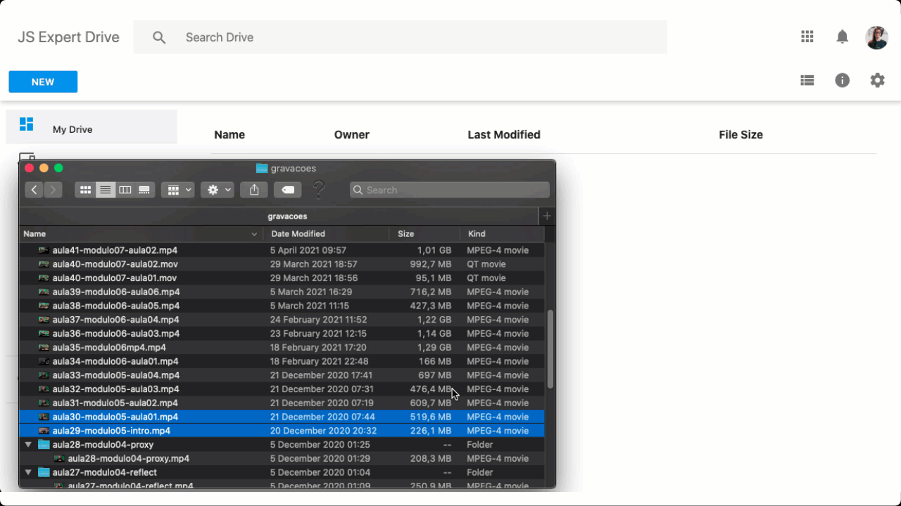

# Google Drive Clone

Este projeto foi desenvolvid a partir do conteúdo da 5ª Semana Javascript Expert feita por ErickWendel.

Trata-se de uma aplicação Web, onde é possível fazer upload arquivos grandes e visualizá-los. Foi utilizado NodeJS no backend e JavaScript puro no frontend.

## Como rodar
Acesse o diretório gdrive-webapi, instale as dependências (`npm install`) e rode o projeto (`npm start`). Repita o mesmo processo no diretório gdrive-webapp para executar o Frontend.  

## Checklist Imersão
Requisitos implementados na imersão:

- Web API
    - [x] Deve listar arquivos baixados
    - [x] Deve receber stream de arquivos e salvar em disco
    - [x] Deve notificar sobre progresso de armazenamento de arquivos em disco
    - [x] Deve permitir upload de arquivos em formato image, video ou audio
    - [x] Deve atingir 100% de cobertura de código em testes

- Web App
    - [x] Deve listar arquivos baixados
    - [x] Deve permitir fazer upload de arquivos de qualquer tamanho
    - [x] Deve ter função de upload via botão
    - [x] Deve exibir progresso de upload
    - [x] Deve ter função de upload via drag and drop
